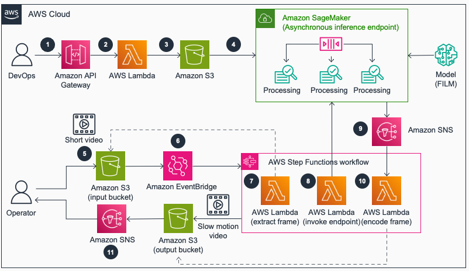

# Guidance for Super Slow Motion Video Creation Using Generative AI on AWS 

## Table of Content

1. [Overview](#overview)
    - [Cost](#cost)
2. [Prerequisites](#prerequisites)
    - [Operating System](#operating-system)
3. [Deployment Steps](#deployment-steps)
4. [Deployment Validation](#deployment-validation)
5. [Running the Guidance](#running-the-guidance)
6. [Next Steps](#next-steps)
7. [Cleanup](#cleanup)

## Overview

This guide demonstrates how to utilize generative AI models such as Google's [Frame Interpolation for Large Motion (FILM)](https://github.com/google-research/frame-interpolation) to produce super slow motion video from standard footage. FILM is a frame interpolation model that analyzes motion between input frames and synthesizes new transitional frames, creating seamless, ultra-high frame rate slow motion. We will host the FILM model at scale using Amazon SageMaker to process the video frames. The original frames and synthesized frames will then be assembled into a high frame rate slow motion video. Side-by-side comparison videos will showcase the contrast between the original footage and the 3x slow motion result.

Original Video          |  Slow-Mo Video
:-------------------------:|:-------------------------:
  |  

### Architecture Diagram


The architecture diagram above provides an overview of the full end-to-end solution. However, this sample focuses only on the core component highlighted in bold below. Users can reference the complete solution architecture to understand how this example fits into the bigger picture, and build on top of it as needed.

1. DevOps engineer calls an Amazon API Gateway endpoint to create a model endpoint
2. Amazon API Gateway invokes an AWS Lambda function to process the request
3. AWS Lambda function uploads model artifacts (FILM model) and endpoint configuration to an Amazon Simple Storage Service (Amazon S3) bucket and creates an endpoint
4. **On endpoint creation, Amazon SageMaker creates an Asynchronous Inference Endpoint with autoscaling feature**
5. Operator upload a short video to an Amazon S3 bucket for processing
6. An Amazon S3 event triggers an AWS Step Functions state machine execution to process the request.
7. An AWS Lambda function **extracts frames from the video and store them in S3 bucket**
8. An AWS Lambda function **creates an inference job by invoking the SageMaker Asynchronous inference endpoint where FILM model interpolates new frames. The state machine execution is on paused and waits for a job completion status**
9. SageMaker Inference endpoint sends job status to Amazon Simple Notification Service (Amazon SNS)
10. The state machine execution resumes where an AWS Lambda function **encodes all new frames to create a slow motion video and store in S3 bucket**

### Cost
_You are responsible for the cost of the AWS services used while running this Guidance. As of December 2023, the cost for running this Guidance with the default settings and default sample video in the `US-East-1` is approximately `$3.50`._

## Prerequisites
You need to have an AWS account. Make sure your AWS identity has the requisite permissions which includes ability to create SageMaker Resources (Domain, Model, and Endpoints) in addition to S3 access to upload model artifacts. Alternatively, you can attach the [AmazonSageMakerFullAccess](https://docs.aws.amazon.com/sagemaker/latest/dg/security-iam-awsmanpol.html#security-iam-awsmanpol-AmazonSageMakerFullAccess) managed policy to your IAM User or Role.

### Operating System

This notebook is tested using default python3 kernel on SageMaker Studio. An GPU instance such as `ml.g4dn.xlarge` is recommended.

### Service limits

You need at least one `ml.g5.4xlarge` instance for inference, more if you want to process multiple video chunks in parallel. Please make sure your AWS account has sufficient quota for SageMaker inference.

## Deployment Steps

1. To deploy the soltuion manually, download the [AWS CloudFormation template](deployment/cfn_template.txt) to your local hard drive.

2. Sign in to the [AWS CloudFormation console](https://console.aws.amazon.com/cloudformation/home).

3. Select **Create Stack**.

4. On the **Create stack** page, Specify **template section**, select **Upload a template file**.

5. Under **Upload a template file**, select **Choose file** and select the edited template from your local drive.

6. Choose Next and follow the steps in Launch the stack.
  
8. This will take a few minutes and set up a [SageMaker Studio Domain](https://docs.aws.amazon.com/sagemaker/latest/dg/sm-domain.html). Follow the instructions [here](https://docs.aws.amazon.com/sagemaker/latest/dg/studio-launch.html) to launch the Studio environment.

9. In SageMaker Studio, clone this Git repository using the command below. More details on how to clone Git repository in SageMaker Studio is [here](https://docs.aws.amazon.com/sagemaker/latest/dg/studio-tasks-git.html).

```bash
git clone https://github.com/aws-solutions-library-samples/guidance-for-super-slow-motion-video-creation-using-generative-ai-on-aws.git
```

## Deployment Validation

After successfully cloning the repo, following files and libraries will be downloaded in the following directory structure:

```
|-- assets/                      Assets folder
|-- deployment/                  CloudFormation template to deploy SageMaker environment
|-- source/                      Code directory to host FILM model and generate slow-mo video
|   |--slow-mo.ipynb
|   |--helper.py
    └── slow_mo_generator        Model and inference code for SageMaker Asynchronous Inference
        |-- interpolator.py
        |-- model.py
        |-- requirements.txt
        |-- serving.properties
        └── utils.py
```

## Running the Guidance

1. cd to the repo folder ```guidance-for-super-slow-motion-video-creation-using-generative-ai-on-aws```

2. open [slow-mo.ipynb](source/slow-mo.ipynb) notebook, and follow the instructions to run through each cell. 

3. Note: the notebook automatically provide a sample video to test. Please feel free to replace the sample video with your own.

## Next Steps
To further enhance your solution at scale, there are several suggested next steps. First, create automated orchestration using AWS Step Functions to coordinate the workflow. Second, add an automated event trigger so that uploading a video to S3 will automatically trigger the orchestration. Third, incorporate AWS Batch jobs to split and assemble frames in order to maximize system parallelization. Finally, if you want to process 4K videos, you can adjust the model input parameters to split each 4K frame into 4 slices and then process each slice in parallel. Implementing these recommendations will allow you to scale your video processing pipeline to handle higher volumes with optimal performance. 
## Cleanup
To avoid incurring AWS charges after you are done with testing the guidance, make sure you delete below resources-

1.	Amazon SageMaker Studio Domain. 

2. 	Amazon SageMaker Asynchronous Inference Endpoint.
